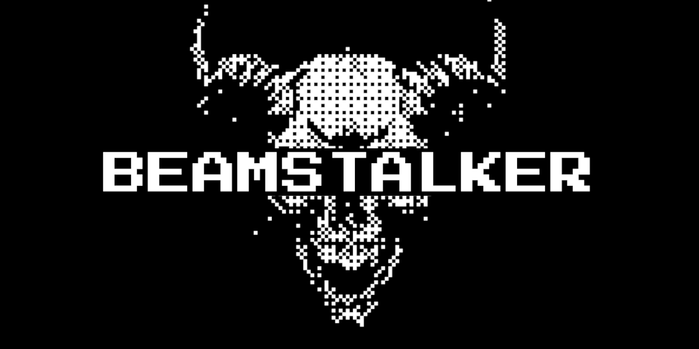

<p align="center"><sub><i>Knowledge should be free 🏴‍☠️</i></sub></p>

# BeamStalker

BeamStalker is a modular embedded RF experimentation firmware built around a shared UI, service, and backend abstraction layer.

It targets multiple boards with very different displays and input methods while keeping the user experience, command surface, and internal app model consistent across targets.

BeamStalker was initially bootstrapped from the [Neutrino](https://github.com/st4lk3r-unit/neutrino) firmware skeleton, then heavily extended into its own multi-target RF platform.

## 🖥️ Supported targets

| Target | Status | Display | Input | Notes |
|---|---:|---|---|---|
| `native` | ✅ | SDL2 desktop window | keyboard | Linux debug target |
| `native-headless` | ✅ | none | konsole / stdin | headless Linux target |
| `esp32s3-tpager` | ✅ | 480×222 ST7796 | keyboard + encoder | main handheld target |
| `esp32s3-tdongle-s3` | ✅ | 160×80 ST7735 | single button | compact dongle target |
| `esp32s3-cardputer` | ✅ | 240×135 ST7789 | keyboard | compact keyboard target |
| `esp32s3-heltec-v3` | ✅ | 128×64 SSD1306 | single button | minimal OLED target |
| `cardputer-adv` | 🚧 | TBD | TBD | work in progress |

> BeamStalker is multi-target by design, but not “universal” yet.  
> The goal is a shared firmware architecture across supported boards, not fake portability.

## 📡 Current wireless backends

| Backend | Status | Notes |
|---|---:|---|
| Wi-Fi (ESP32) | ✅ | scan, capture, AP-style tooling, raw 802.11 features depending on target/backend |
| BLE (ESP32) | ✅ | scan + advertisement tooling |
| Native Linux | ✅ | debug / UI / service development target |
| Other radio backends | 🚧 | planned through the abstraction layer |

## ✨ Features

Current firmware features include:

- multi-target UI with a shared navigation model
- native Linux target for development and debugging
- Wi-Fi scanning
- Wi-Fi packet capture to `.pcap`
- Wi-Fi beacon tooling
- Wi-Fi deauth tooling
- captive portal / evil twin style workflows
- karma / honeypot style workflows
- BLE scanning
- BLE advertisement tooling
- on-device logs and status views
- konsole command interface for full control without relying on the UI

## 🛠️ Build

BeamStalker uses PlatformIO.

### Requirements

Before building, make sure you clone the repository **with its submodules**:

```bash
git clone --recurse-submodules https://github.com/st4lk3r-unit/BeamStalker.git
cd BeamStalker/firmware
````

If you already cloned the repository without submodules:

```bash
git submodule update --init --recursive
```

You will also need:

* Python
* [PlatformIO](https://platformio.org/)
* a supported toolchain for the selected target

### Build examples

```bash
# native desktop
pio run -e native

# native headless
pio run -e native-headless

# LilyGO T-Pager
pio run -e esp32s3-tpager

# LilyGO T-Dongle-S3
pio run -e esp32s3-tdongle-s3

# M5Stack Cardputer
pio run -e esp32s3-cardputer

# Heltec WiFi LoRa 32 V3
pio run -e esp32s3-heltec-v3
```

## ⚡ Flash

After building, you can flash directly with PlatformIO:

```bash
pio run -e esp32s3-tpager -t upload
```

You can also use [release binaries](https://github.com/st4lk3r-unit/BeamStalker/releases/latest) with external flashers, depending on the board and boot flow:

* `esptool.py`
* browser flashers such as [`esptool-js`](https://espressif.github.io/esptool-js/)
* launchers such as [`M5Launcher`](https://github.com/bmorcelli/Launcher) where applicable

## 🎮 Controls

BeamStalker exposes a common interaction model across targets even when the physical inputs differ.

The abstract navigation model is built around:

* **Up / Down / Left / Right**
* **Enter / Confirm**
* **Back**
* optional extra shortcuts depending on the target

This means a full keyboard target, a rotary target, and a single-button target can all drive the same UI logic.

### 🧭 UI mapping

On keyboard-oriented targets, the default mental model is:

* `W A S D` → navigate
* `Enter` → confirm
* `Backspace` → back

Some targets also expose:

* arrow keys
* rotary encoder navigation
* single-button navigation patterns
* board-specific shortcuts where available

### ⌨️ Konsole

BeamStalker can also be controlled through **Konsole**, a command-driven interface exposed over serial / console.

This matters especially on targets where physical input is minimal or awkward, such as dongles and one-button boards.

Konsole is meant to provide:

* full target control without depending on the on-device UI
* a better workflow for automation and testing
* a path toward scripting and boot-time command execution later on

## 🙏 Acknowledgements / inspirations

A few projects and people helped shape BeamStalker, directly or indirectly:

* [st4lk3r-unit/neutrino](https://github.com/st4lk3r-unit/neutrino) for the original firmware template and early architectural groundwork
* [@sdardouchi](https://github.com/sdardouchi) for the GitHub Pages work and the broader old-school phone / embedded scene around [OperationSE](https://github.com/OperationSE)
* [@Eun0us](https://github.com/Eun0us) for research and ideas around ESP console workflows via [Shell-ESP32](https://github.com/Eun0us/Shell-ESP32)
* [@bmorcelli](https://github.com/bmorcelli) for [M5Launcher](https://github.com/bmorcelli/Launcher) and related handheld firmware ecosystem work
* [@pr3y](https://github.com/pr3y) for [Bruce Firmware](https://github.com/pr3y/Bruce)
* [@7h30th3r0n3](https://github.com/7h30th3r0n3) for [Evil-M5Project](https://github.com/7h30th3r0n3/Evil-M5Project)
* [@Spacehuhn](https://github.com/SpacehuhnTech) for prior art and research around ESP raw Wi-Fi tooling

And to all the projects that pushed the scene forward: knowledge should be free 🏴‍☠️

*Made with fun by akpalanaza.*
